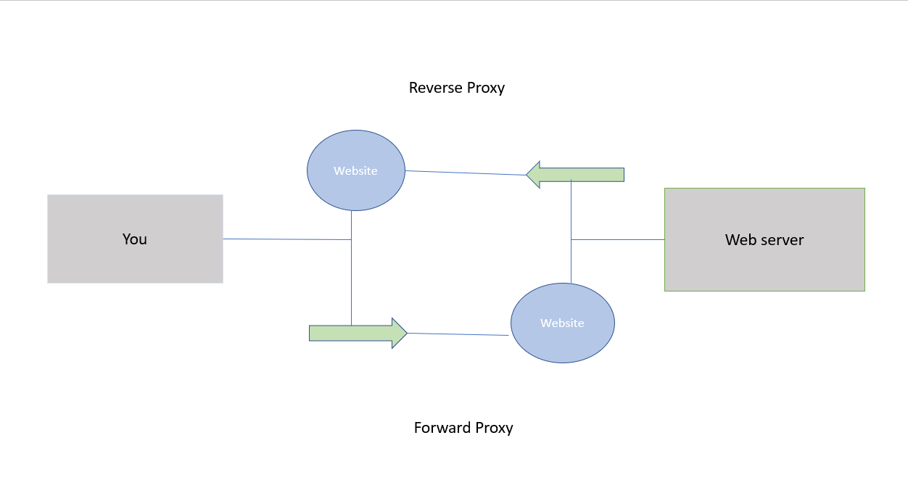
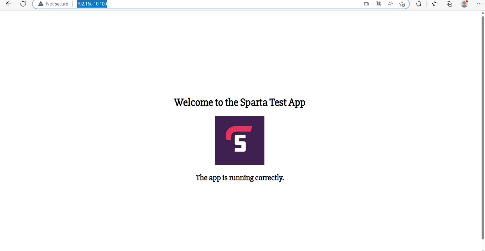

# Nginx Reverse Proxy

### What are ports?

Ports are online places where specific services pass through, for example emails, http messages or file transfers.

----

### What is a reverse proxy? How is it different to a forward proxy?

Proxies act as intermediaries between users and servers.

The main difference between a forward proxy and a reverse proxy is that a forward proxy masks the original IP address so can help with security for the user whereas the reverse proxy does the opposite as is used to protect web servers as well as help with overloading.

----

### What is Nginx's default configuration?

The following information comes from docs.nginx.com...

Nginx's default configurations are:

`user   nobody;`
`worker processes   1;`
`events {
    worker connections 1024;
}`

----

### How do you set up an Nginx reverse proxy?

You would need to be in the correct location, then specify the proxy_pass directive.

E.g...

`location /some/path/ {
    proxy_pass http://www.example.com/link/;
}`

This would pass all requests in this location to the proxied server at the specified address. The address can also be specified as a domain name or IP address and the address may include a port:

`location ~ \.php {
    proxy_pass http://127.0.0.1:8000;
}`

----

To pass a request to a non-HTTP proxied server, the appropriate **_pass directive should be used:

`fastcgi_pass` to pass a request to a FastCGI server

`uwsgi_pass` to pass a request to a uwsgi server

`scgi_pass` to pass a request to a SCGI server

`memcached_pass` to pass a request to a memcached server

----

### Passing Request Headers

By default, NGINX redefines two header fields in proxied requests, "Host" and "Connection", and eliminates the header fields whose values are empty strings. "Host" is set to the `$proxy_host` variable and "Connection" is set to `close`

----

# NGINX reverse proxy

To make an NGINX reverse proxy...

Make sure you're in the app VM in home and it's `ready and listening`, then:

`sudo nano /etc/nginx/sites-available/default`

----

Get to the place where it says `server_name`

And put in:

`192.168.10.100;` in place of `_`

----

Under that in the `location` section of `server_name` and replace what is there with:

`location / {
        proxy_pass http://localhost:8080;
        proxy_http_version 1.1;
        proxy_set_header Upgrade $http_upgrade;
        proxy_set_header Connection 'upgrade';
        proxy_set_header Host $host;
        proxy_cache_bypass $http_upgrade;
    }`

and change the localhost to what you need.  In this case:

`3000`

----

Under that copy and paste:

    `location /app2 {
        proxy_pass http://localhost:8081;
        proxy_http_version 1.1;
        proxy_set_header Upgrade $http_upgrade;
        proxy_set_header Connection 'upgrade';
        proxy_set_header Host $host;
        proxy_cache_bypass $http_upgrade;
    }`

changing the localhost again to `3000`
and `/app2` to `/posts` so it will also pass the `posts` page.

----

Check your syntax errors by entering:

`sudo nginx -t`

then restart nginx:

`sudo systemctl restart nginx` so it will reconfigure and include the reverse proxy.

----

Go into the `app` directory (twice if needed), then:

`npm start` or `node app.js`

----

If you go to the web browser and type in:

`192.168.10.100`

You should see:

Success!

----

If you go to the web browser and type in:

`192.168.10.100/posts` you should get to the posts page.

----

The port number is no longer included.

----

To automate the process, make sure your provision files include the added commands.

Check `provision_app.sh` if you'd like to see the script.

----
